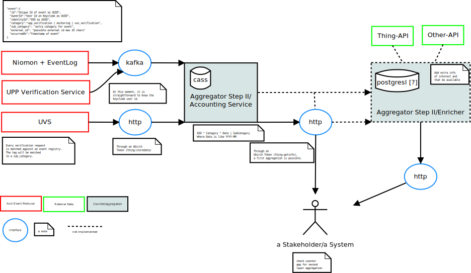

# Ubirch Accounting Service

This service listens for AcctEvent records and stores them on Cassandra. It exposes a http interface as well that support querying.

1. [Categories supported](#categories)
2. [Query through http Interface](#http-interface)
3. [Ingestion through Kafka Interface](#kafka-interface-ingestion)
4. [Ingestion through HTTP Interface](#http-interface-ingestion)
5. [Counter Tool](counter/README.md)
6. [Swagger](#swagger)



## Categories

The system has three principal categories. 

- `anchoring`, and 
- `upp_verification`, and 
- `uvs_verification`.

All UPPs that pass by Niomon are registered against the Accounting Service by the Event Log.

All UPPs/Hashes that are verified with the version 2 of the verification service are registered against the Accounting Service

All UVS verifications are registered against this service in batches of 100.

## Http Interface

1. [Getting Started](#steps-to-prepare-a-request)
2. [List Your Acct Events](#list-your-acct-events)

### Steps to prepare a request

1. Get your `ubirch` token.
2. Prepare the query params.
3. Prepare the request and send.

### List Your Acct Events

#### Ubirch JWT Token

In order to use the endpoints of this service, you need an Ubirch Token with scopes: `getinfo` and `storedata`

#### Report by month

This endpoint allows you to get a report of the number of events registered for a particular identity for a particular month. You can optionally filter by subcategory or tag.

```shell script
curl -s -X GET -H "authorization: bearer $token" \
 -H "content-type: application/json" \
  "http://localhost:8081/api/acct_events/v1/$identityId?cat=$category&date=$date&sub_cat=$sub_cat" \
 | jq .
```

**Fields**

_identity_id_: It is a device id or identity id. 

_category_: It is the category for the stored event. Use `anchoring` or `verification`.

_date_: It is the date of the query. The format is "yyyy-MM". Only the year and moth are taken into account.

_subCategory_: (Optional) It is the subcategory for the stored event.


# An Accounting Event

```json
{
  "id":"d1b6f970-2f6b-4c94-aa49-a7bb5b3ba363",
  "ownerId":"6cb65b4e-4121-47cd-845a-63f4005fe6b3",
  "identityId":"39092dd9-0e72-41b3-b6b0-cd414e6d55a2",
  "category":"verification",
  "subCategory": "entry_a",
  "externalId": "39092dd9-0e72-41b3-b6b0-cd414e6d55a2",
  "occurredAt":"2020-11-06T12:42:34.976Z"
}
```

**Fields**

_id_: it represents the id of the event.

_ownerId_: it is the keycloak id of the logged-in user.

_identityId_: It represents the identity that generated the UPP or event. The device id or app id.

_category_: It represents the kind of event. That's to say, what action originated it.

_subCategory_: (Optional) It represents a subkind of event. Useful for partitioning data by another element.

_externalId_: (Optional) It represents an external value that can be used as an optional id. Max length is 36.

_occurredAt_: It represents the time at which the event took place.

# Kafka Interface Ingestion

The system will be listening to the configured topic and will store the account events to cassandra. 

# Http Interface Ingestion

The system provides a http endpoint that allows to register events through http. 

```bash
curl -v -X POST http://localhost:8081/api/acct_events/v1/record \
  -H "authorization: bearer $token" \
  -H "content-type: application/json" \
  -d '[
        {
          "id":"d1b6f970-2f6b-4c94-aa49-a7bb5b3ba363",
          "ownerId":"6cb65b4e-4121-47cd-845a-63f4005fe6b3",
          "identityId":"39092dd9-0e72-41b3-b6b0-cd414e6d55a2",
          "category":"verification",
          "sub_category":"entry_a",
          "occurredAt":"2020-11-06T12:42:34.976Z"
        },
        {
          "id":"d1b6f970-2f6b-4c94-aa49-a7bb5b3ba364",
          "ownerId":"6cb65b4e-4121-47cd-845a-63f4005fe6b3",
          "identityId":"39092dd9-0e72-41b3-b6b0-cd414e6d55a2",
          "category":"verification",
          "sub_category":"entry_a",
          "occurredAt":"2020-11-06T12:42:34.976Z"
        }
      ]'
```

# Ubirch Token and Responses

In order for any request be received and executed, the initiator must provide proof it has been granted with the required permissions.
In order to do so, its request must contain an Authorization header.

## The Header

```
Authorization: <type> <token>

where 
  <type> is Bearer
  <token> is the JWT token for the current logged in user. This token originates from Keycloak.
``` 

## The Responses

```
The <response> codes could be:

1. <200 OK>           When the system found a proper verification.
2. <400 Badrequest>   When the incoming data has not been properly parsed or accepted.            
3. <403 Forbidden>    When the token is invalid.
4. <401 Unauthorized> When no Authorization header is found in the request.
                      In this case, the response will contain the following header 
                      WWW-Authenticate: <type> realm=<realm>
                      
                      where <type> is Bearer and
                           <realm> is "Ubirch Accounting Service"
5. <500 Internal Server Error> When an internal error happened from which it is not possible to recover.
```

# Swagger

Visit https://accounting.dev.ubirch.com/docs on your browser to see the swagger docs.
