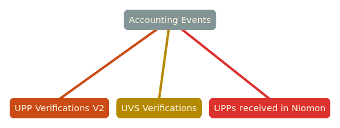
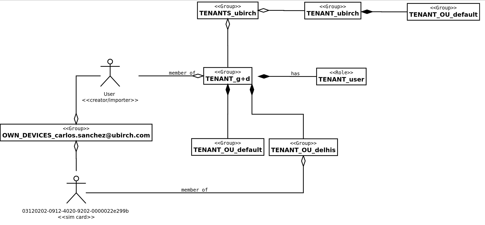

= Tenant Consumption Report

WARNING: -> This presentation is dangerous!

== Motivation?

[.fade-in-then-semi-out%step]
Improve our inventory of services with counting features.

[.fade-in-then-semi-out%step]
API for our accounting that offers a JSON for all our tenants & sub-tenants.

[.fade-in-then-semi-out%step]
Aggregator/enrichment system that decorates events with relevant billing data.

[.fade-in-then-semi-out%step]
Make life easier to Markus and Oli.

== A word about accounting events

== A word about tenants

== It is showtime!

[.fade-in-then-semi-out%step]
Let's see something a bit more practical

[.fade-in-then-semi-out%step]
https://ubirch.atlassian.net/wiki/spaces/UBD/pages/2355364014/How+to+generate+a+Tenant+Consumption+Report[Click here to go to the documentation]

== We made it: Thanks
