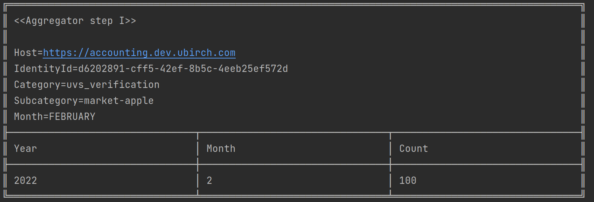

# Account Counter Tool

It is a node-based application that allows to query the accounting service API. 
The following tool allows you to easily get the current's YTM (Year To Month) registered accounting events for a particular identity
and a category. Optionally, you can filter further by subcategory (also known by some clients as tag).

- Make sure you have node installed. [Node page](https://nodejs.org/en/).
- Make sure you have npm installed. [NPM js page](https://docs.npmjs.com/downloading-and-installing-node-js-and-npm)
- Run `npm install`
- Create a `config.json` file in the root folder of the counter app with the following info.
    ```json
    {
      "host": "https://accounting.STAGE.ubirch.com, where STAGE: [dev, demo, prod]",
      "token": "UBIRCH JWT TOKEN with get:info scope and the target id as the identity id"
    }
    ```
- Read this section about supported categorie. [A word about categories](https://github.com/ubirch/ubirch-accounting-service#categories).
- `node monthlyReport.js --id=UUID_OF_IDENTITY --cat=CATEGORY --date=YYYY-MM --subcat=SUBCATEGORY` -> subcat is optional


